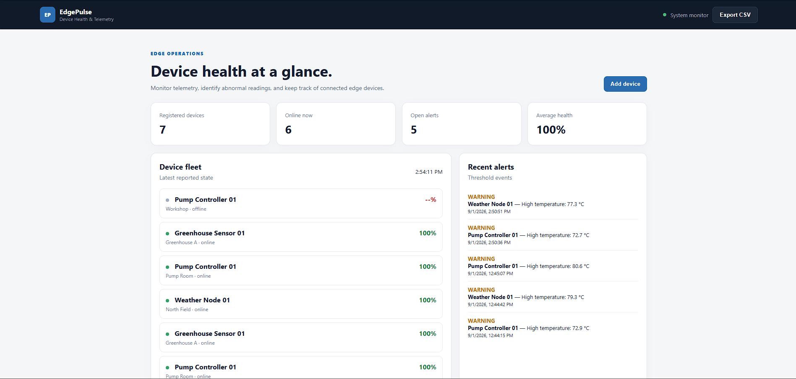
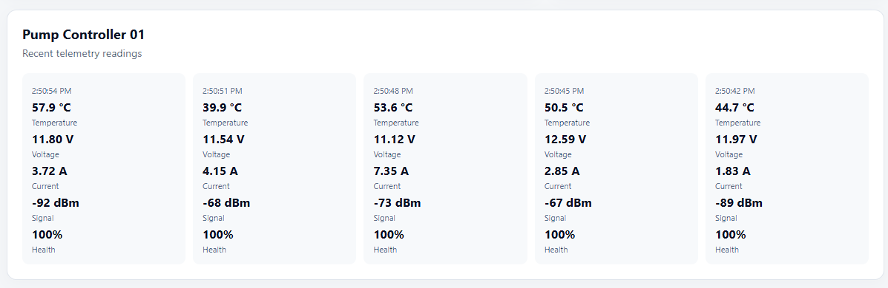

# EdgePulse

## Device Health & Telemetry Monitoring Platform

EdgePulse is a lightweight device monitoring platform built with **FastAPI, SQLite, HTML, CSS, and JavaScript**.

It collects telemetry from connected edge devices, evaluates device health, detects abnormal operating conditions, generates alerts, and presents the latest device state through a clean web dashboard.


## Features

- Device registration and management
- Real-time-style device health dashboard
- Telemetry ingestion through REST APIs
- Automatic health-score calculation
- Threshold-based alert generation
- Device online/offline status
- Recent telemetry visualization
- Recent alerts panel
- CSV telemetry export
- Automatic dashboard refresh
- Built-in telemetry simulator
- SQLite database for local persistence
- Health evaluation logic with automated tests


## System Architecture

```text
                    ┌───────────────────────┐
                    │     Edge Devices      │
                    │ Sensors / Controllers │
                    └──────────┬────────────┘
                               │
                               │ Telemetry
                               ▼
                    ┌───────────────────────┐
                    │     FastAPI API       │
                    │                       │
                    │   Device Management   │
                    │  Telemetry Ingestion  │
                    │   Health Evaluation   │
                    │   Alert Generation    │
                    └──────────┬────────────┘
                               │
                         ┌─────┴─────┐
                         ▼           ▼
                  ┌────────────┐ ┌────────────┐
                  │  SQLite DB │ │  REST API  │
                  └────────────┘ └──────┬─────┘
                                        │
                                        ▼
                              ┌──────────────────┐
                              │   Web Dashboard  │
                              │    HTML/CSS/JS   │
                              └──────────────────┘

## Health Monitoring

EdgePulse evaluates incoming telemetry and produces a device health score.

The monitoring system considers conditions such as:
Temperature
Voltage
Current
Signal strength
Other configured operating thresholds

## Dashboard

The dashboard provides an operational overview of the device fleet.

It displays:
Registered devices
Devices currently online
Open alerts
Average fleet health
Individual device health
Device location and status
Recent alerts
Recent telemetry readings

## REST API

Devices
    GET  /api/devices
    POST /api/devices

Telemetry
    POST /api/devices/{device_id}/telemetry
    GET  /api/devices/{device_id}/telemetry

Alerts
    GET /api/alerts

Statistics
    GET /api/stats

Export
    GET /api/export

## Project Structure   

EdgePulse/
│
├── app/
│   ├── main.py
│   ├── health.py
│   └── __init__.py
│
├── frontend/
│   ├── index.html
│   ├── style.css
│   └── app.js
│
├── simulator/
│   └── device_simulator.py
│
├── tests/
│   └── test_health.py
│
├── docs/
│   ├── PROJECT_OVERVIEW.md
│   ├── dashboard.png
│   └── telemetry.png
│
├── README.md
├── requirements.txt
└── .gitignore   

## Running Locally

1. Clone the repository
    git clone https://github.com/Omi2413/EdgePulse.git
    cd EdgePulse

2. Create a virtual environment
    Windows:

    python -m venv .venv
    .venv\Scripts\activate

3. Install dependencies
    pip install -r requirements.txt

4. Start the application
    uvicorn app.main:app --reload

5. Open the dashboard
    http://127.0.0.1:8000/

API documentation is available through FastAPI's interactive documentation:
    http://127.0.0.1:8000/docs
 

## Dashboard Preview


## Telemetry Details
